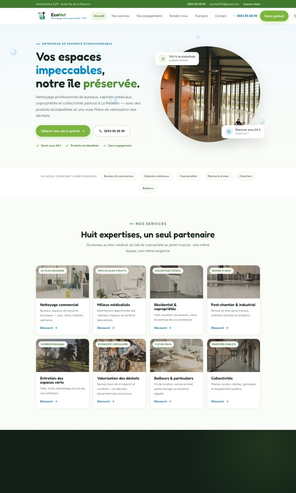

# EcoNet 974 - Maquette de refonte

> **Proposition de refonte du site [econet974.com](https://www.econet974.com/)** - entreprise de nettoyage professionnel écoresponsable à La Réunion.
> Maquette réalisée par **VANTURA** · contenus, chiffres et témoignages d'exemple.



## 🚀 Lancer en local

Aucun build, aucune dépendance à installer :

```bash
python3 -m http.server 8080
```

puis ouvrir <http://localhost:8080>. (Un serveur est nécessaire - le routeur et les images ne fonctionnent pas en `file://`.)

## 🧭 Ce que contient la maquette

**16 pages** servies par un routeur hash (`#/…`) dans une seule `index.html` :

| Page | Route | Notes |
|---|---|---|
| Accueil | `#/` | intro « coup de raclette », histoire du fondateur épinglée au scroll, comparateur sale/propre, carte de La Réunion |
| Services | `#/services` + 8 fiches `#/services/<slug>` | effet « nettoyage » au survol des cartes |
| Engagements | `#/engagements` | économie circulaire, garanties |
| À propos | `#/a-propos` | |
| Rendez-vous | `#/rdv` | réservation de créneau, créneaux occupés bloqués en direct |
| Devis | `#/devis` | parcours guidé en 4 étapes |
| Contact | `#/contact` | FAQ, WhatsApp, horaires |
| **Espace client** | `#/espace-client` | code démo **2024** - photos du chantier, devis (PDF téléchargeable), planning, messagerie, factures |
| **Espace pro** | `#/admin` | code démo **9744** - agenda, détection de conflits, créateur de devis, synchro agenda (simulée) |
| Mentions légales | `#/mentions-legales` | |

Autres points clés : mode clair/sombre (clair par défaut), responsive audité de 320 px à 1024 px+, PDF de devis généré côté client (jsPDF, TVA 8,5 % Réunion), données de démo en `localStorage` (mise à jour en direct entre onglets via l'événement `storage`).

## 📁 Structure

```
econet974-maquette/
├── index.html          # structure des 16 pages + routeur
├── css/styles.css      # design system (tokens EcoNet : vert #7DB63F, bleu #0E8AC2)
├── js/app.js           # routeur, agenda, portail client, devis PDF, animations
├── assets/
│   ├── logo.png        # logo officiel EcoNet (fond transparent)
│   └── img/            # photos (issues du site actuel du client)
└── docs/
    ├── EcoNet974-Proposition-VANTURA.pdf   # dossier de présentation client (12 p.)
    ├── proposition-refonte.html            # version web du dossier (audit avant/après)
    └── apercu.jpg
```

## 🌐 Publier sur GitHub Pages

Settings → Pages → *Deploy from a branch* → branche `main`, dossier `/ (root)`. Le site est statique, il fonctionne tel quel (le fichier `.nojekyll` est déjà là).

## ⚠️ Avant une mise en production réelle

- Remplacer les **témoignages, chiffres et données de démo** par les vrais contenus ; compléter SIRET et mentions légales.
- Brancher les formulaires (devis, RDV, messagerie) sur un vrai backend - la démo persiste en `localStorage` uniquement.
- Synchronisation agenda réelle : Google Calendar API / Microsoft Graph / CalDAV selon l'outil du client.
- PWA : manifest + service worker + notifications push pour l'espace pro.
- Les gardes-fous d'animation (viewport « sain ») peuvent rester : ils sont transparents dans un vrai navigateur.

## 🙏 Crédits

- Logo et photos : © EcoNet 974 (extraits de leur site actuel).
- Fond de carte de La Réunion : © [comersis.com](https://comersis.com) (attribution requise, déjà en pied de carte).
- Bibliothèques chargées via CDN : [GSAP + ScrollTrigger](https://gsap.com) 3.12.5, [jsPDF](https://github.com/parallax/jsPDF) 2.5.1. Polices : Fredoka & Figtree (Google Fonts).

---

*Maquette de démonstration - VANTURA · septembre 2026*
